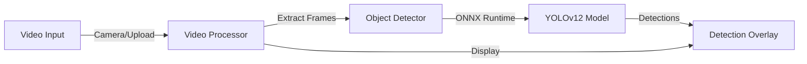

# YOLOv12 ONNX Runtime Web


A minimalistic real-time object detection application built with YOLOv12 and ONNX Runtime Web for browser-based AI inference.

## 🚀 Quick Start

### Prerequisites

- Node.js 20+ 
- Modern browser with WebGPU support (Chrome, Edge, or Firefox)
- Camera access (for live detection)

### Installation

1. **Clone and install dependencies:**
   ```bash
   git clone <repository-url>
   cd ai-object-detector-poc
   npm install
   ```

1. **Start the development server:**
   ```bash
   npm run dev
   ```

1. **Open your browser:**
   Navigate to `http://localhost:5173` (Vite default port)

### Build for Production

```bash
npm run build
```

The built files will be in the `dist` directory, ready to be deployed to GitHub Pages or any static hosting service.

### Test and release gates

```bash
npm test                    # frontend unit/component + Worker runtime tests
npm run test:unit:coverage  # enforced core-logic coverage thresholds
npm run test:e2e            # Chromium route, responsive, and accessibility cases
npm run check               # complete local CI gate
```

Pull requests and `main` run the same gates in GitHub Actions. A successful `main` run unlocks guarded GitHub Pages and Cloudflare Worker deployments. See [Testing and delivery](./docs/07-testing-and-delivery.md) for the use-case matrix, required environment configuration, rollback procedure, and release ownership.

## 🏗️ Architecture



### Technical Architecture

### Frontend Stack
- **Vite**: Fast build tool and dev server
- **React 19**: UI components and state management
- **TypeScript**: Type safety and better development experience
- **Shadcn/ui**: Modern component library with tabs
- **Tailwind CSS**: Utility-first styling

### AI/ML Stack
- **ONNX Runtime Web**: Browser-based AI inference
- **YOLOv12n**: Object detection model architecture
- **Worker-isolated Processing**: Model execution stays in a dedicated browser worker; the API handles authentication, leases, and proof manifests

### Key Components

- **`src/App.tsx`** - Main application component with tabs for different input modes
- **`src/main.tsx`** - React entry point
- **`src/components/`** - UI components for video upload, camera stream, and detection overlay
- **`src/lib/object-detector.ts`** - Core detection engine using ONNX Runtime
- **`src/lib/video-processor.ts`** - Handles video frame extraction and processing
- **`public/models/`** - YOLOv12 ONNX model and metadata

### Deployment to GitHub Pages

This project is configured for GitHub Pages deployment. The GitHub Actions workflow (`.github/workflows/deploy.yml`) will automatically build and deploy the app when you push to the main branch.

**Important:** Make sure to update the `base` path in `vite.config.ts` to match your repository name if it's different from `ai-object-detector`.

**Built with React, Vite, ONNX Runtime Web, and YOLOv12**

## Wallet authentication and contracts

Crossflow connects Rabby, MetaMask, Phantom EVM, and WalletConnect-compatible wallets through Wagmi. The configured chain is Arbitrum Sepolia (`421614`). Connecting a wallet does not authenticate a session: the user must also sign the server-issued EIP-4361 message.

Apply local migrations once, then start the frontend and authentication Worker together:

```bash
npm run db:migrate:local
npm run dev
```

The Worker uses D1 for single-use nonces, sessions, and inference manifests. Before deployment, create a real D1 database, replace the placeholder `database_id` in `wrangler.jsonc`, set the production `APP_ORIGIN`, apply migrations remotely, and deploy. Never place the explorer API key in a `VITE_` variable.

Run the Solidity test suite and compile the exact browser deployment artifact with:

```bash
npm run contract:test
npm run contract:artifact
npm run contract:compile
```

The fixed platform admin is `0x2a1F44Ce3759b8624aD8b5828efEe2Dd370DCa1e`. After that wallet is connected and SIWE-authenticated, `/admin/zones` can edit versioned room zones, publish them on-chain, and deploy `TrafficPredictionMarket` through Rabby, MetaMask, or Phantom. The testnet role-wallet kit generates the oracle, market-operator, and dispute-resolver wallets locally, encrypts each one as a standard Web3 V3 keystore with a user-supplied password, and fills only their public addresses into the constructor. Deployment stays locked until all three backups are downloaded and explicitly confirmed. The password is never stored, and a page reload discards the encrypted in-memory kit, so keep the files and password offline. Signing remains inside the connected admin wallet; the application never accepts or transmits a raw private key.

After deployment, set `VITE_MARKET_CONTRACT_ADDRESS` for the frontend and set the same address as the Worker's `MARKET_CONTRACT_ADDRESS`. Markets are discovered per room on-chain; there is no build-time active-market ID to rotate.

Continuous rounds use one `MarketScheduler` Durable Object keyed by the MARKET_ROLE account. This is intentional: a shared EOA nonce is the coordination boundary, so creation transactions for different rooms are serialized while public round reads remain stateless and horizontally scalable. Durable Object alarms create the next market when the current betting window locks, and a two-minute Cron Trigger acts as a recovery watchdog.

Start with Tokyo only (`AUTO_MARKET_ROOMS=tokyo`). After deploying the replacement contract, configure the testnet operator secret:

```bash
npx wrangler secret put MARKET_OPERATOR_PRIVATE_KEY
```

For local development, copy `.dev.vars.example` to `.dev.vars` and insert the MARKET_ROLE testnet key. The Worker verifies that the secret-derived address is the contract's current MARKET_ROLE before spending gas. Never put the key in `wrangler.jsonc`, a `VITE_` variable, logs, or source control. A Worker secret is acceptable for this testnet automation stage; move signing into a policy-controlled KMS/MPC or isolated signer service before the contract holds production value.

Result proposal remains deliberately separate from market creation. Browser inference manifests are not yet sufficient to trigger an ORACLE_ROLE signature because source authenticity and round-bound evidence still require a stronger attestation boundary. A passing local suite is a release gate, not a substitute for an independent audit; do not describe the contract as “bulletproof” or deploy it to mainnet without one.

The app currently identifies `0xDe5D11Af502eA4E11c8eA02F2ff22cd6a41b0139` as its Arbitrum Sepolia contract. The admin dashboard reports it as a legacy rectangle-zone deployment; four-corner trapezoid publication requires deploying the regenerated artifact and then setting `VITE_MARKET_CONTRACT_ADDRESS` to that new address.

Use the Arbiscan/Etherscan API key only after deployment for source verification on chain `421614`. It is intentionally excluded from the browser bundle and source control.

The application never asks for a seed phrase, private key, backup file, or remote-control access. A legitimate Crossflow signature always states that it authenticates a session and does not authorize a transaction or transfer.

## Room coordination and proof boundary

Each room is a separate SQLite-backed Durable Object. An authenticated operator acquires a two-minute lease before inference starts. The coordinator rejects a second operator, expires abandoned leases with an alarm, and requires the lease token when accepting the final manifest. Because room IDs map to independent objects, Tokyo traffic does not serialize Paris traffic and capacity scales by room rather than through one global lock.

The proof manifest commits to the approved model hash, execution provider, input dimensions, room, time window, final count, and the admin-controlled zone version/configuration hash. The Worker atomically rejects a manifest if that zone changes while the proof is being verified. This makes evidence tampering detectable. It does **not** prove that an untrusted browser showed an authentic camera stream. Production settlement still requires independently captured source-segment hashes, threshold oracle attestations, or a verifiable-compute/TEE system. Never describe a single browser detector as trustless.

Contract results follow `Open → Proposed → Challenged/Finalized → Resolved`. A proposal has a 15-minute bonded challenge period. Payout claims remain unavailable until finalization. The dispute role must be independent from the room operator and oracle.

Inference timing is measured in the worker across preprocessing, ONNX execution, and post-processing. The room HUD displays the actual total latency and selected provider. Validate the desktop, mobile, and WASM targets on a device matrix; model size, quantization, browser, memory, and input dimensions all materially affect the result.

## 🙏 Credits & Inspiration

- **Inspired by:** [Hyuto / yolov8-onnxruntime-web](https://github.com/Hyuto/yolov8-onnxruntime-web)  
- **Stock image:** [Group of people sitting beside rectangular wooden table with laptops — Unsplash](https://unsplash.com/photos/group-of-people-sitting-beside-rectangular-wooden-table-with-laptops-34GZCgaVksk)
