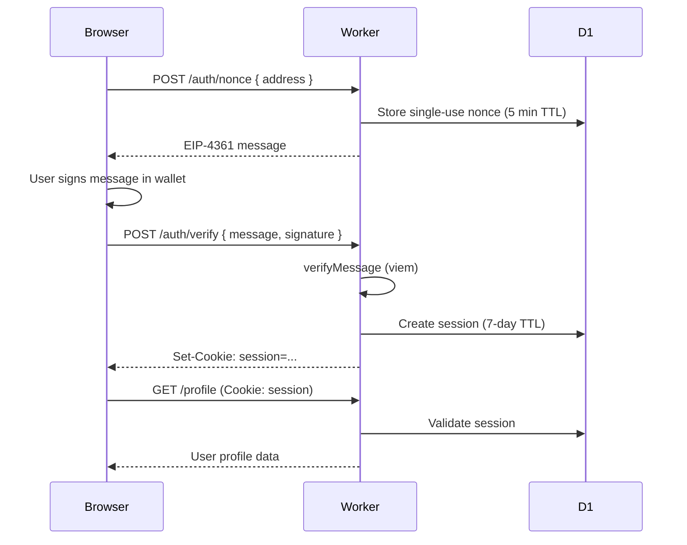
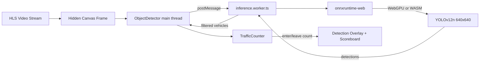

# 01 — Application Architecture

## Overview

Crossflow is a three-tier application:

1. **Frontend** — Static SPA built with Vite, served from GitHub Pages (production) or `localhost:5173` (development).
2. **Backend** — Cloudflare Worker (`crossflow-auth`) providing REST API, SIWE auth, D1 persistence, and Durable Object coordination.
3. **Blockchain** — `TrafficPredictionMarket` Solidity contract on Arbitrum Sepolia for pari-mutuel betting and round settlement.

There is **no WebSocket layer**. Market state is polled every 5 seconds. Video uses **HLS** (`.m3u8`), not MJPEG.

---

## Directory Structure

```
yolov12-onnxruntime-web/
├── src/                          # React frontend
│   ├── main.tsx                  # Wagmi + React Query + Theme + Router entry
│   ├── App.tsx                   # Route definitions (lazy-loaded pages)
│   ├── pages/                    # Route-level screens
│   │   ├── LiveTrafficGame.tsx   # Landing: 3D globe + room selection
│   │   ├── RoomPage.tsx          # Live HLS + detection + betting
│   │   ├── ProfilePage.tsx       # SIWE profile + proof history
│   │   ├── LeaderboardPage.tsx   # Operator leaderboard
│   │   ├── ActivityPage.tsx      # Recent inference manifests
│   │   ├── HowItWorksPage.tsx    # Product explainer
│   │   └── Admin*.tsx            # Admin hub, zones, contracts, explorer
│   ├── components/               # UI components
│   │   ├── place-position-button.tsx
│   │   ├── detection-overlay.tsx
│   │   ├── detection-scoreboard.tsx
│   │   └── admin/                # Contract deploy, zone editor, controls
│   ├── lib/                      # Core business logic
│   │   ├── wagmi.ts              # Wallet config (Arbitrum Sepolia)
│   │   ├── market-contract.ts    # Contract ABI + address resolution
│   │   ├── room-market.ts        # useRoomMarket polling hook
│   │   ├── object-detector.ts    # ONNX detector singleton
│   │   ├── traffic-counter.ts    # Vehicle enter/leave counting
│   │   └── globe-markers.ts      # Room definitions + HLS stream URLs
│   ├── config/
│   │   ├── game-config.ts        # Betting limits, bet types, network
│   │   └── detection-zone.ts     # Platform admin address, zone types
│   ├── workers/
│   │   └── inference.worker.ts   # Module worker for ONNX execution
│   └── globals.css
├── worker/                       # Cloudflare Worker
│   ├── index.ts                  # HTTP route handler
│   ├── room-coordinator.ts       # Durable Object: per-room operator leases
│   ├── market-rounds.ts          # Durable Object: automated market creation
│   └── migrations/               # D1 SQL (0001–0004)
├── contracts/
│   ├── TrafficPredictionMarket.sol
│   └── TrafficPredictionMarket.t.sol
├── public/
│   ├── models/                   # yolov12n.onnx (~12 MB), model-metadata.json
│   └── contracts/                # Compiled artifact JSON for deploy UI
├── scripts/
│   ├── build-contract-artifact.mjs
│   ├── env-writer-plugin.mjs     # Vite plugin: auto-update env on deploy
│   └── trigger-scheduler.sh      # Local cron simulation
├── wrangler.jsonc                # Worker configuration
├── vite.config.ts                # Vite + COOP/COEP headers
├── hardhat.config.ts
└── docs/                         # This handoff documentation
```

---

## Frontend Architecture

### Provider Stack

```
main.tsx
  └── WagmiProvider (wagmiConfig — WalletConnect + injected providers)
        └── QueryClientProvider (@tanstack/react-query)
              └── ThemeProvider (next-themes — dark/light)
                    └── BrowserRouter
                          └── App.tsx (lazy-loaded routes)
```

### Routing

| Path | Component | Purpose |
|------|-----------|---------|
| `/` | `LiveTrafficGame` | 3D globe, room selection, market builder |
| `/room/:roomId` | `RoomPage` | Live HLS stream, detection overlay, betting panel |
| `/profile` | `ProfilePage` | SIWE-authenticated user profile + proof history |
| `/leaderboard` | `LeaderboardPage` | Top operators by manifest count |
| `/activity` | `ActivityPage` | Recent inference manifests (public) |
| `/how-it-works` | `HowItWorksPage` | Product explainer |
| `/admin` | `AdminPage` | Admin hub + contract compatibility check |
| `/admin/zones` | `AdminZonesPage` | Trapezoid zone editor + on-chain publish |
| `/admin/contracts` | `AdminContractsPage` | Contract deploy + role wallet generation |
| `/admin/explorer` | `AdminExplorerPage` | Contract address inspection |

### State Management

There is **no global store** (no Redux, Zustand, or similar). State is managed through:

| Mechanism | Usage |
|-----------|-------|
| `useState` / `useEffect` | Component-local UI state |
| `useRoomMarket(roomId)` | Polls `GET /rooms/:id/market` every 5s |
| Wagmi hooks | Wallet connection, `writeContract`, `readContract`, balances |
| HTTP session cookie | SIWE-authenticated session (7-day TTL) |
| `getSharedDetector()` | Singleton `ObjectDetector` instance |

### Wallet Integration

- **Library:** Wagmi 3 + Viem 2
- **Chain:** Arbitrum Sepolia only (`chainId: 421614`)
- **Connectors:** WalletConnect (requires `VITE_WALLETCONNECT_PROJECT_ID`) + injected provider discovery (MetaMask, Rabby, Phantom EVM)
- **Auth separation:** Connecting a wallet does **not** authenticate a session. Users must separately sign an EIP-4361 SIWE message.

---

## Backend Architecture (Cloudflare Worker)

### Bindings

| Binding | Type | Purpose |
|---------|------|---------|
| `DB` | D1 SQLite | Nonces, sessions, zones, inference manifests, rate limits |
| `ROOMS` | Durable Object (`RoomCoordinator`) | Per-room operator lease (120s, single operator) |
| `MARKET_SCHEDULER` | Durable Object (`MarketScheduler`) | Serialized `createMarket` transactions |

### Durable Object Design

**RoomCoordinator** (one instance per room ID):
- Grants 2-minute exclusive leases to authenticated operators
- Rejects concurrent operators for the same room
- Expires abandoned leases via alarm
- Requires lease token when accepting inference manifests

**MarketScheduler** (keyed by MARKET_ROLE EOA address):
- Serializes `createMarket` transactions (shared EOA nonce is the coordination boundary)
- Cron trigger every 2 minutes as recovery watchdog
- Creates next market when current round is closed/resolved
- Requires on-chain zone published (`zoneVersion > 0`) before creating markets

### Authentication Flow



---

## Computer Vision Pipeline



### Key Design Decisions

| Decision | Rationale |
|----------|-----------|
| Module worker for inference | Keeps main thread responsive during ONNX execution |
| WebGPU preferred, WASM fallback | WebGPU is faster; WASM works on more devices |
| Model hash verification | `caches.open('crossflow-approved-models-v1')` rejects tampered models |
| COOP/COEP headers | Enable SharedArrayBuffer for ONNX threads in production builds |
| Trapezoid ROI (4 corners) | Admin-configurable detection zone in basis points (0–10000) |

### Vehicle Counting Logic

`TrafficCounter` (`src/lib/traffic-counter.ts`) implements centroid-based tracking:

1. Match detections across frames by proximity (Hungarian-style assignment).
2. Track whether each vehicle was **outside** the zone, then **entered**, then **left**.
3. Count only vehicles that complete the full enter → leave cycle.
4. Filter to vehicle classes: `bicycle`, `car`, `motorcycle`, `bus`, `truck`.

---

## Video Streaming

Rooms use public HLS feeds defined in `src/lib/globe-markers.ts`:

| Room ID | Stream type |
|---------|-------------|
| `tokyo` | StreamGuys HLS |
| `sydney` | Field59 HLS |
| `sf` | WRAL HLS |
| `paris` | IPCamLive HLS |
| `nyc`, `london` | Caltrans DOT HLS |

Playback uses `hls.js/light` in `RoomPage` and `AdminZonesPage`. Safari uses native HLS.

### COOP/COEP Implications

| Environment | Headers | HLS impact |
|-------------|---------|------------|
| Development (`vite`) | COOP only | Cross-origin HLS works |
| Production build | COOP + COEP `require-corp` | HLS streams need CORS headers from origin |

---

## Deployment Topology

### Current CI (GitHub Actions)

- **Frontend only:** `.github/workflows/deploy.yml` builds and deploys static `dist/` to GitHub Pages.
- **Worker:** Manual `wrangler deploy` — not in CI.
- **Contract:** Manual via `/admin/contracts` UI or external tooling.

### Production Considerations

| Component | Hosting | Notes |
|-----------|---------|-------|
| Frontend | GitHub Pages (static) | Set `BASE_PATH` for repo name; configure `VITE_AUTH_API_URL` to Worker URL |
| Worker | Cloudflare Workers | Replace placeholder D1 `database_id`; set `APP_ORIGIN` to production frontend URL |
| Contract | Arbitrum Sepolia (testnet) | Mainnet requires audit + multisig admin |
| ONNX model | Bundled in `public/models/` | ~12 MB; consider CDN for production |
| HLS streams | Third-party origins | No SLA; streams can go offline |

---

## Legacy / Unused Components

These exist from the original YOLO POC and are **not wired into current routes**:

| File | Original purpose |
|------|------------------|
| `src/components/camera-stream.tsx` | Webcam `getUserMedia` |
| `src/components/video-upload.tsx` | File upload detection |
| `src/components/image-upload.tsx` | Image upload detection |
| `src/components/stream-tile.tsx` | Multi-stream tile grid |
| `src/lib/video-processor.ts` | Legacy frame processor |

Safe to remove in a cleanup pass, but not blocking functionality.
