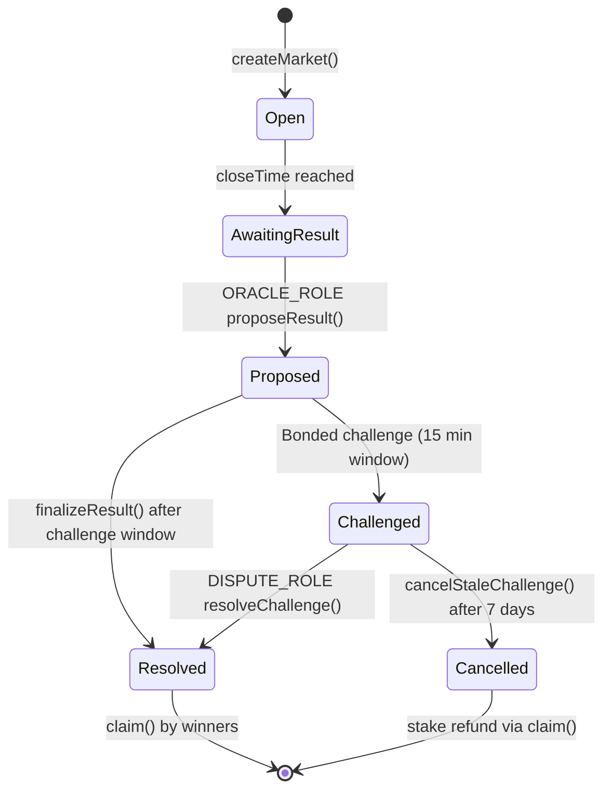
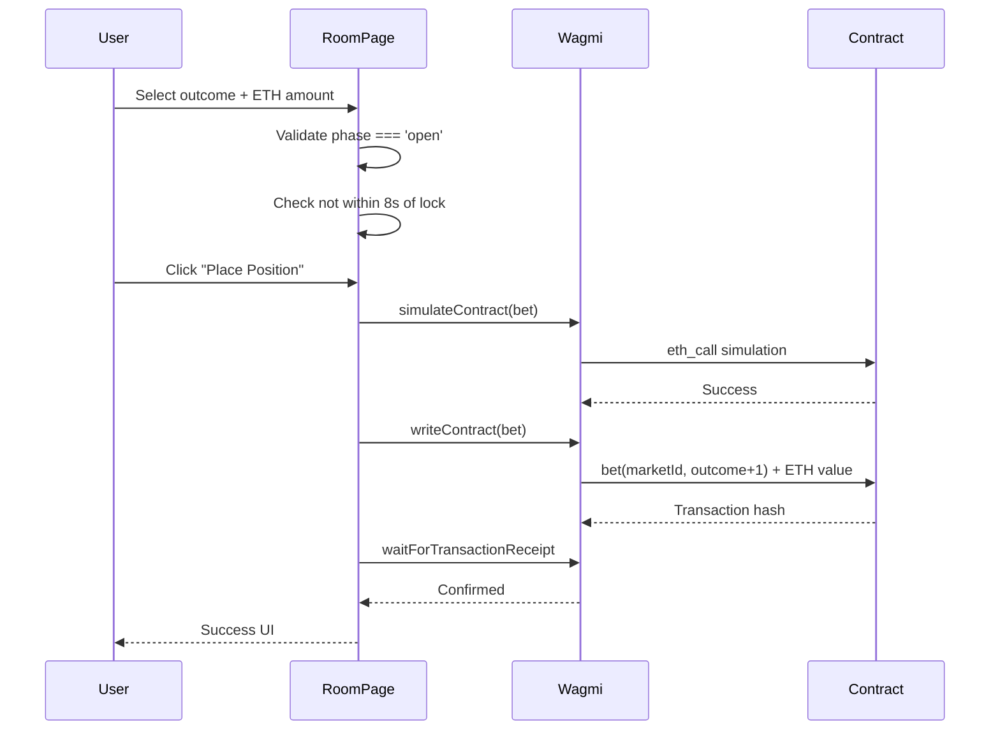
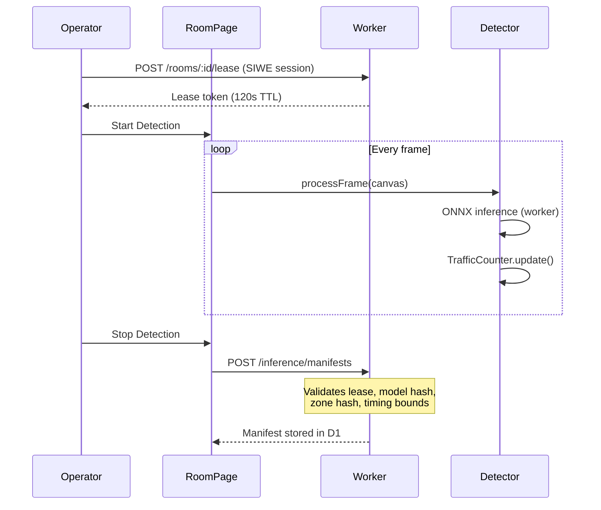
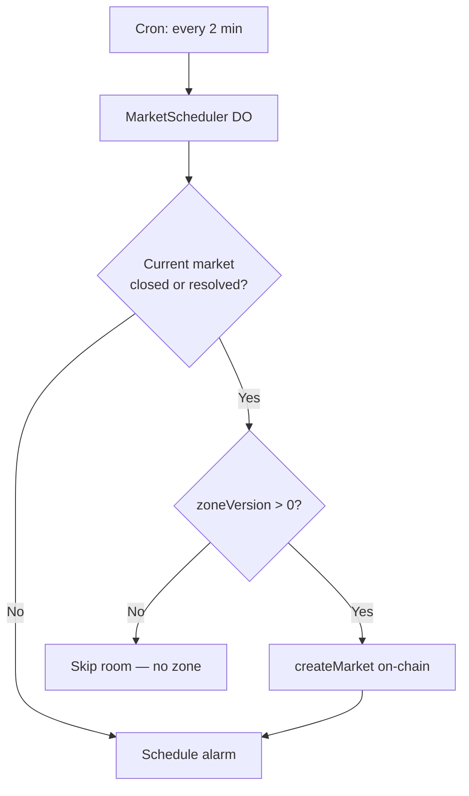

# 02 — Core Game Logic

## Game Concept

Crossflow is a **pari-mutuel traffic prediction market**. Users bet ETH on how many vehicles will pass through a defined detection zone during a betting round. All stakes form the payout pool — the protocol never promises fixed odds.

---

## Betting Outcomes

Four mutually exclusive outcomes are defined in `src/config/game-config.ts` and mapped to the contract `Outcome` enum (1-indexed on-chain):

| ID | Name | Contract enum | Resolution rule |
|----|------|---------------|-----------------|
| 0 | UNDER | `Under` (1) | `count < lowerBound` |
| 1 | RANGE | `Range` (2) | `lowerBound ≤ count ≤ upperBound` (and not exact) |
| 2 | OVER | `Over` (3) | `count > upperBound` |
| 3 | EXACT | `Exact` (4) | `count == exactTarget` |

### Resolution Priority

The contract resolves in this order (see `contracts/README.md`):

1. **Exact** — if `count == exactTarget`
2. **Under** — if `count < lowerBound`
3. **Range** — if `lowerBound ≤ count ≤ upperBound` and not exact
4. **Over** — if `count > upperBound`

"Exact" takes priority over "Range" because otherwise an exact count would also satisfy the range condition.

### Default Round Parameters

Configured in `wrangler.jsonc`:

| Parameter | Default | Description |
|-----------|---------|-------------|
| `MARKET_LOWER_BOUND` | 10 | Under wins below this |
| `MARKET_UPPER_BOUND` | 30 | Over wins above this |
| `MARKET_EXACT_TARGET` | 20 | Exact wins on this count |
| `MARKET_BETTING_WINDOW_SECONDS` | 300 (5 min) | Duration betting is open |
| `MARKET_RESOLUTION_WINDOW_SECONDS` | 600 (10 min) | Time after close for oracle to propose |
| `MARKET_FEE_BPS` | 200 (2%) | Protocol fee on winning pool |

### Betting Limits

From `GAME_CONFIG.BETTING` in `src/config/game-config.ts`:

| Limit | Value |
|-------|-------|
| Minimum stake | 0.001 ETH |
| Maximum stake | 10 ETH |
| Submission guard | 8 seconds before lock — bets rejected |
| Preset amounts | 0.001, 0.01, 0.05, 0.1, 0.5, 1 ETH |

---

## Round Lifecycle

### On-Chain States



### UI Phases

The Worker exposes simplified phases to the frontend (`PlayerMarketPhase`):

| Phase | Meaning | User actions |
|-------|---------|--------------|
| `unavailable` | No market / room disabled | Wait for scheduler |
| `open` | Betting window active | Place bets |
| `awaiting_result` | Betting closed, waiting for oracle | Operator runs detection |
| `proposed` | Oracle submitted result | Challenge window (15 min) |
| `challenged` | Result disputed | Awaiting dispute resolution |
| `resolved` | Final result | Winners can claim |
| `cancelled` | Market cancelled | Bettors reclaim stakes |

Phase mapping logic lives in `worker/market-rounds.ts` (`derivePlayerPhase`).

---

## Betting Flow (Implemented)



**Implementation:** `src/components/place-position-button.tsx`

Key validations before submission:
- Wallet connected on Arbitrum Sepolia
- Market phase is `open`
- Market state is not stale
- Current time is more than 8 seconds before `closeTime`
- Stake is within min/max bounds

---

## Detection & Counting Flow (Implemented)



### Operator Lease Rules

- **Duration:** 120 seconds (2 minutes)
- **Exclusivity:** Only one operator per room at a time
- **Requirement:** Valid SIWE session + lease token to submit manifest
- **Expiry:** Abandoned leases expire via Durable Object alarm

### Inference Manifest Contents

Submitted to `POST /inference/manifests` and stored in D1:

| Field | Purpose |
|-------|---------|
| `model.sha256` | Must match `APPROVED_MODEL_SHA256` in Worker config |
| `executionProvider` | `webgpu` or `wasm` only |
| `roomId` | Room identifier |
| `zoneVersion` / `zoneConfigHash` | Must match current zone (atomic rejection on change) |
| `windowStart` / `windowEnd` | Inference time window |
| `finalCount` | Vehicle count result |
| `leaseToken` | Proves operator held valid lease |

### Manifest Validation Rules (Worker)

- Model SHA-256 must match approved hash
- Execution provider must be `webgpu` or `wasm`
- Inference duration: max 120 seconds
- Manifest must be submitted within 60 seconds of window end
- Zone config hash must match current D1 zone at submission time

---

## Detection Zone System

### Coordinate System

Zones are **trapezoids** defined by 4 corners in **basis points** (0–10000 = 0%–100% of frame dimensions):

```
topLeft ───────────── topRight
    │                     │
    │    detection ROI    │
    │                     │
bottomLeft ────────── bottomRight
```

### Zone Hash

Canonical hash committed on-chain and in manifests:

```
keccak256(abi.encode(roomKey, uint16[8]))
```

Where `uint16[8]` is `[topLeftX, topLeftY, topRightX, topRightY, bottomRightX, bottomRightY, bottomLeftX, bottomLeftY]`.

### Zone Lifecycle

1. Admin drags corners in `/admin/zones` (saved to D1)
2. Admin clicks "Publish saved zone on-chain" → `setRoomZone(roomId, geometry[8])`
3. Contract increments `zoneVersion` and stores `configHash`
4. `MarketScheduler` requires `zoneVersion > 0` before creating markets
5. Market creation snapshots the zone hash — later edits don't affect open markets

**Platform admin:** Fixed address `0x2a1F44Ce3759b8624aD8b5828efEe2Dd370DCa1e` — only this wallet can call `setRoomZone`.

---

## Market Automation (Implemented)

The `MarketScheduler` Durable Object handles continuous round creation:



**Requirements for automation:**
- `MARKET_OPERATOR_PRIVATE_KEY` secret matches on-chain `MARKET_ROLE`
- `MARKET_CONTRACT_ADDRESS` points to trapezoid-compatible deployment
- Room is in `AUTO_MARKET_ROOMS` list
- On-chain zone is published for the room

**Local testing:** Trigger manually with:
```bash
curl "http://localhost:8787/cdn-cgi/handler/scheduled"
# or
./scripts/trigger-scheduler.sh
```

---

## Payout Model

Pari-mutuel: winners split the pool proportionally to their stakes.

```
winnerPayout = (userStake / winningOutcomePool) × (totalPool - protocolFee)
```

- Protocol fee: `feeBps` (default 200 = 2%) taken from total pool
- If no winning bets exist, all stakes are refundable
- Claims use pull-payment pattern (user calls `claim(marketId)`)

---

## What's NOT Implemented

These contract functions exist but have **no frontend or automation**:

| Function | Role | Status |
|----------|------|--------|
| `proposeResult(marketId, count, evidenceHash)` | ORACLE_ROLE | No UI, no manifest → oracle pipeline |
| `challengeResult(marketId, evidenceHash)` | Any (bonded) | Static `ChallengeTimeline` decoration only |
| `finalizeResult(marketId)` | Anyone | No automation after challenge window |
| `resolveChallenge(marketId, upheld)` | DISPUTE_ROLE | No UI |
| `claim(marketId)` | Winners | No claim UI |

See [04 — Implementation Roadmap](./04-implementation-roadmap.md) for the plan to wire these.

---

## Rooms

Six rooms are configured in `AUTO_MARKET_ROOMS`:

| Room ID | Display name | Stream source |
|---------|--------------|---------------|
| `tokyo` | Tokyo | StreamGuys |
| `sydney` | Sydney | Field59 |
| `sf` | San Francisco | WRAL |
| `paris` | Paris | IPCamLive |
| `nyc` | New York | Caltrans DOT |
| `london` | London | Caltrans DOT |

> **Known issue:** `nyc` and `london` streams are US Caltrans feeds, not actual NYC/London cameras. Update `src/lib/globe-markers.ts` with correct streams.

Room IDs are hashed on-chain: `keccak256(toBytes(roomId))` → `bytes32`.
