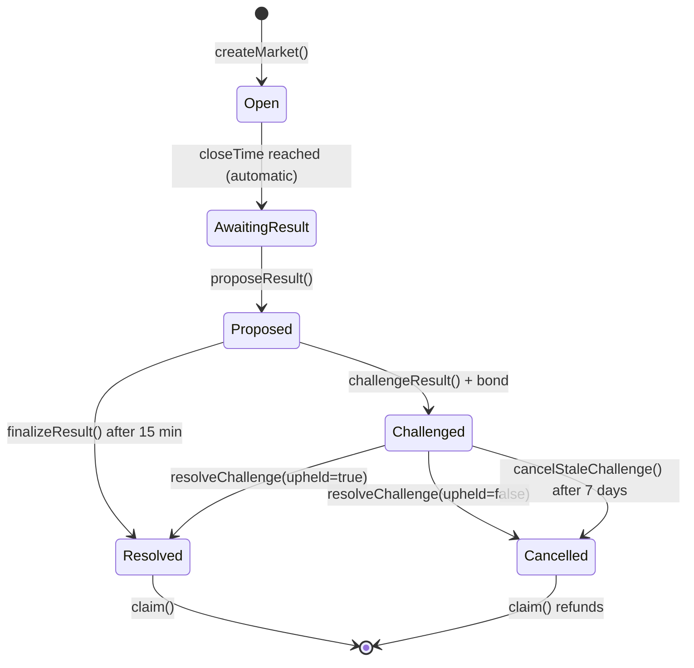

# 06 — Smart Contracts

## Contract Overview

**Name:** `TrafficPredictionMarket`  
**Language:** Solidity 0.8.24  
**Framework:** OpenZeppelin Contracts 5.x  
**Network:** Arbitrum Sepolia (testnet)  
**Pattern:** Pari-mutuel ETH prediction market

**Source:** `contracts/TrafficPredictionMarket.sol`  
**Tests:** `contracts/TrafficPredictionMarket.t.sol`  
**Artifact:** `public/contracts/TrafficPredictionMarket.json`

---

## Core Concepts

### Pari-Mutuel Model

All user stakes form the payout pool. The protocol never promises fixed odds. Winners split the pool proportionally:

```
payout = (userStake / winningOutcomePool) × (totalPool - protocolFee)
```

### Detection Zones

Each room has a configurable trapezoid detection zone:
- 4 corners defined in basis points (0–10000)
- Monotonic version number
- Canonical hash: `keccak256(abi.encode(roomKey, uint16[8]))`
- Snapshotted when a market is created — later edits don't affect open markets
- Only the fixed platform admin can write zones

### Resolution Priority

The contract maps `finalCount` to winner (not the oracle):

1. **Exact** — `count == exactTarget`
2. **Under** — `count < lowerBound`
3. **Range** — `lowerBound ≤ count ≤ upperBound` (and not exact)
4. **Over** — `count > upperBound`

---

## Roles

| Role | Hash | Purpose | Holder |
|------|------|---------|--------|
| `DEFAULT_ADMIN_ROLE` | `0x00...00` | Pause, fee withdrawal, role rotation | Deployer (should be multisig) |
| `PLATFORM_ADMIN` | Hardcoded address | `setRoomZone` only | `0x2a1F44Ce3759b8624aD8b5828efEe2Dd370DCa1e` (immutable) |
| `ORACLE_ROLE` | `keccak256("ORACLE_ROLE")` | `proposeResult` | Oracle wallet (constructor) |
| `MARKET_ROLE` | `keccak256("MARKET_ROLE")` | `createMarket` | Market operator (Worker automation) |
| `DISPUTE_ROLE` | `keccak256("DISPUTE_ROLE")` | `resolveChallenge` | Dispute resolver (constructor) |

**Constructor requires 4 distinct addresses** — overlapping roles are rejected.

**Admin transfer delay:** 2 days (OpenZeppelin `AccessControlDefaultAdminRules`).

---

## Market Lifecycle

### States (enum `MarketStatus`)

| Value | Name | Description |
|-------|------|-------------|
| 0 | Open | Betting active |
| 1 | AwaitingResult | Betting closed, oracle must propose |
| 2 | Proposed | Result submitted, challenge window open |
| 3 | Challenged | Result disputed |
| 4 | Resolved | Final — claims available |
| 5 | Cancelled | Market cancelled — stake refunds |

### State Transitions



### Time Windows

| Window | Duration | Trigger |
|--------|----------|---------|
| Betting | Configurable (default 5 min) | `closeTime` in `createMarket` |
| Resolution | Configurable (default 10 min) | `resolveDeadline` in `createMarket` |
| Challenge | 15 minutes | After `proposeResult` |
| Dispute resolution | 7 days | After challenge |
| Admin transfer | 2 days | `transferAdmin` |

---

## Key Functions

### Market Creation

```solidity
function createMarket(
    bytes32 roomId,
    uint64 closeTime,
    uint64 resolveDeadline,
    uint32 lowerBound,
    uint32 upperBound,
    uint32 exactTarget,
    uint16 feeBps
) external onlyRole(MARKET_ROLE) returns (uint256 marketId);
```

- Requires room zone published (`zoneVersion > 0`)
- Rejects if active market exists for room
- Snapshots current zone version and config hash
- Emits `MarketCreated` event

**Called by:** `MarketScheduler` Durable Object (automated via Worker cron)

### Betting

```solidity
function bet(uint256 marketId, uint8 outcome) external payable;
```

- `outcome`: 1=Under, 2=Range, 3=Over, 4=Exact (1-indexed)
- Requires market status `Open` and `block.timestamp < closeTime`
- ETH value is the stake amount
- Emits `BetPlaced` event

**Called by:** `PlacePositionButton` component via Wagmi

### Zone Management

```solidity
function setRoomZone(
    bytes32 roomId,
    uint16[8] calldata geometry
) external;
```

- Only callable by hardcoded `PLATFORM_ADMIN` address
- Increments `zoneVersion`, updates `configHash`
- Geometry: `[topLeftX, topLeftY, topRightX, topRightY, bottomRightX, bottomRightY, bottomLeftX, bottomLeftY]`

**Called by:** `AdminZonesPage` via Wagmi

### Result Proposal

```solidity
function proposeResult(
    uint256 marketId,
    uint32 finalCount,
    bytes32 evidenceHash
) external onlyRole(ORACLE_ROLE);
```

- Requires market status `AwaitingResult`
- Contract computes winner from `finalCount` (not oracle)
- Sets 15-minute challenge deadline
- Emits `ResultProposed` event

**Status:** Contract ready, **no frontend implementation**

### Challenge

```solidity
function challengeResult(
    uint256 marketId,
    bytes32 evidenceHash
) external payable;
```

- Requires market status `Proposed` and within challenge window
- Requires fixed challenge bond (payable)
- Emits `ResultChallenged` event

**Status:** Contract ready, **no frontend implementation**

### Finalization

```solidity
function finalizeResult(uint256 marketId) external;
```

- Requires market status `Proposed` and challenge window expired
- Sets status to `Resolved`
- Emits `ResultFinalized` event

**Status:** Contract ready, **no automation or frontend**

### Dispute Resolution

```solidity
function resolveChallenge(uint256 marketId, bool upheld) external onlyRole(DISPUTE_ROLE);
```

- `upheld=true`: original result stands → `Resolved`
- `upheld=false`: market cancelled → `Cancelled`

```solidity
function cancelStaleChallenge(uint256 marketId) external;
```

- After 7-day dispute deadline with no resolution
- Market cancelled, challenger bond refundable

**Status:** Contract ready, **no frontend implementation**

### Claims

```solidity
function claim(uint256 marketId) external;
```

- Pull-payment pattern
- Winners receive proportional payout
- Losers receive nothing
- Cancelled markets: all bettors reclaim stakes
- Claims do not expire

**Status:** Contract ready, **no frontend implementation**

---

## Read Functions

| Function | Returns | Used by |
|----------|---------|---------|
| `latestMarketIdByRoom(bytes32)` | `uint256` | Worker market reads |
| `getMarket(uint256)` | Full market struct | Worker phase derivation |
| `outcomePools(uint256, uint8)` | `uint256` | Pool display |
| `roomZones(bytes32)` | Zone geometry + version | Zone validation |
| `roleAccount(bytes32)` | `address` | Role verification |
| `nextMarketId()` | `uint256` | Market ID tracking |

---

## Events

| Event | Indexed fields | Purpose |
|-------|---------------|---------|
| `MarketCreated` | `marketId`, `roomId` | New round created |
| `BetPlaced` | `marketId`, `bettor` | User placed bet |
| `ResultProposed` | `marketId` | Oracle submitted result |
| `ResultChallenged` | `marketId`, `challenger` | Result disputed |
| `ResultFinalized` | `marketId` | Result confirmed |
| `Claimed` | `marketId`, `claimer` | Payout collected |
| `RoomZoneUpdated` | `roomId` | Zone published |

---

## Deployment

### Via Admin UI (`/admin/contracts`)

1. Generate or import 3 encrypted Web3 V3 keystores (oracle, market operator, dispute resolver)
2. Download all backups and confirm
3. Connect platform admin wallet on Arbitrum Sepolia
4. Click "One-click redeploy with prepared roles"
5. Auto-updates `VITE_MARKET_CONTRACT_ADDRESS` and `wrangler.jsonc`

### Via Script

```bash
npm run contract:artifact   # Build ABI + bytecode
npm run contract:test       # Run test suite
# Deploy externally with Hardhat/Foundry using artifact in public/contracts/
```

### Post-Deploy Checklist

- [ ] Update `VITE_MARKET_CONTRACT_ADDRESS` in frontend env
- [ ] Update `MARKET_CONTRACT_ADDRESS` in `wrangler.jsonc`
- [ ] Set `MARKET_OPERATOR_PRIVATE_KEY` secret (market operator role key)
- [ ] Fund role wallets with tETH for gas
- [ ] Publish zones for each room via `/admin/zones`
- [ ] Verify contract on Arbiscan (chain 421614)
- [ ] Verify at `/admin/explorer` — should show "compatible"

---

## Testing

```bash
npm run contract:test
```

Test coverage in `TrafficPredictionMarket.t.sol`:

| Test area | Coverage |
|-----------|----------|
| Fixed admin enforcement | Platform admin cannot be changed |
| Invalid geometry | Rejects malformed zone coordinates |
| Zone snapshots | Market captures zone at creation time |
| Stale proof rejection | Old zone versions rejected |
| Privileged challenger rejection | Role holders cannot challenge |
| Pari-mutuel payouts | Correct proportional distribution |
| No-winner refunds | All stakes returned when no winner |
| Stale dispute refunds | Bonds returned after timeout |

---

## Security Considerations

### Implemented

- Role-based access control (OpenZeppelin)
- Pausable (admin can pause all operations)
- Admin transfer delay (2 days)
- Reentrancy protection on claims
- Zone version snapshots prevent retroactive changes
- Challenge bond requirement
- Stale challenge cancellation (7-day timeout)

### Required Before Mainnet

- [ ] Independent security audit
- [ ] Multisig for `DEFAULT_ADMIN_ROLE`
- [ ] Threshold oracle (not single EOA)
- [ ] Independent dispute resolver (multisig or arbitration module)
- [ ] KMS/MPC for role private keys
- [ ] Independent attestation for results (not browser inference)
- [ ] Source-stream segment hash verification

### Intentional Limitations

- Browser inference manifests are **not** sufficient for trustless settlement
- Single oracle EOA is acceptable for testnet only
- No on-chain video verification
- No fixed odds — pari-mutuel only

---

## ABI Location

The contract ABI is duplicated in two places (keep in sync):

| File | Context |
|------|---------|
| `public/contracts/TrafficPredictionMarket.json` | Frontend deploy UI + artifact |
| `src/lib/market-contract.ts` | Frontend contract interactions |
| `worker/market-rounds.ts` | Worker market automation |

After contract changes:
```bash
npm run contract:artifact
# Then update ABI in market-contract.ts and market-rounds.ts if needed
```

---

## Room ID Hashing

Room string IDs are hashed to `bytes32` for on-chain storage:

```typescript
import { keccak256, toBytes } from 'viem';

const roomKey = keccak256(toBytes('tokyo'));
// → 0x... (bytes32)
```

Used consistently across frontend, Worker, and contract.
