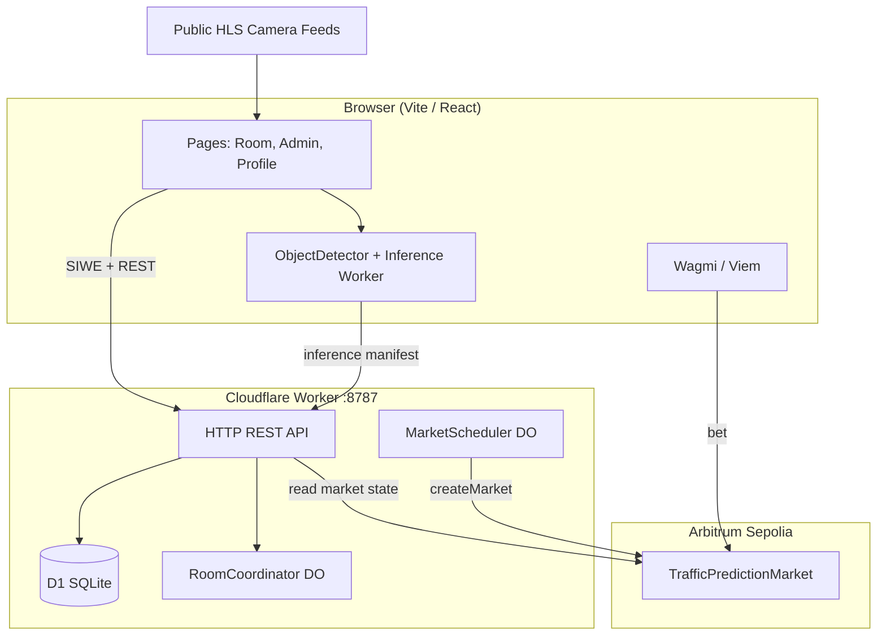

# Crossflow — Technical Handoff Documentation

This documentation set is a technical handoff guide for developers taking over **Crossflow** (repository name: `yolov12-onnxruntime-web`). The application is a browser-based traffic prediction market: users bet on vehicle counts from live HLS camera feeds while operators run YOLOv12 object detection in the browser.

## Product Summary

| Aspect | Detail |
|--------|--------|
| **Product name** | Crossflow |
| **Stack** | Vite + React 19 SPA, Cloudflare Worker API, Solidity on Arbitrum Sepolia |
| **Core loop** | Watch live traffic → bet on count outcomes → operator counts vehicles → oracle proposes result → winners claim |
| **Chain** | Arbitrum Sepolia (`chainId: 421614`) |
| **Inference** | YOLOv12n ONNX via `onnxruntime-web` (WebGPU / WASM) |

> **Note:** This is **not** a Next.js application. The parent monorepo `AGENTS.md` references Next.js/Reown AppKit from a sibling project and does not apply here.

## Documentation Index

| Document | Purpose |
|----------|---------|
| [01 — Architecture](./01-architecture.md) | System design, directory layout, data flows, deployment topology |
| [02 — Game Logic](./02-game-logic.md) | Betting rules, round lifecycle, detection counting, proof manifests |
| [03 — Dependencies & Setup](./03-dependencies-and-setup.md) | Package requirements, environment variables, local dev, production config |
| [04 — Implementation Roadmap](./04-implementation-roadmap.md) | What's done, what's missing, phased plan to reach full functionality |
| [05 — Backend API](./05-backend-api.md) | Cloudflare Worker routes, D1 schema, Durable Objects |
| [06 — Smart Contracts](./06-smart-contracts.md) | `TrafficPredictionMarket.sol`, roles, on-chain lifecycle |

## Existing Reference Docs

These files predate this handoff set and remain useful:

| File | Contents |
|------|----------|
| [`../README.md`](../README.md) | Project origin (YOLO POC) + Crossflow wallet/contract notes |
| [`../TESTNET_SETUP.md`](../TESTNET_SETUP.md) | Step-by-step testnet deployment walkthrough |
| [`../contracts/README.md`](../contracts/README.md) | Contract resolution model and production requirements |
| [`../src/docs/map-components-specs.md`](../src/docs/map-components-specs.md) | Globe/marker UI design spec |

## Quick Start (New Developer)

```bash
# 1. Install dependencies
npm install

# 2. Create frontend env (gitignored)
cat > .env.development.local << 'EOF'
VITE_WALLETCONNECT_PROJECT_ID=your_walletconnect_project_id
VITE_AUTH_API_URL=http://localhost:8787
EOF

# 3. Create worker secrets
cp .dev.vars.example .dev.vars
# Edit .dev.vars — add MARKET_OPERATOR_PRIVATE_KEY (64 hex chars, no 0x)

# 4. Apply local D1 migrations
npm run db:migrate:local

# 5. Run full stack (Vite :5173 + Worker :8787)
npm run dev
```

Open `http://localhost:5173`. For first-time chain setup, follow [04 — Implementation Roadmap](./04-implementation-roadmap.md) Phase 1.

## High-Level System Diagram



## Critical Trust Boundaries

1. **Browser inference manifests** prove model hash, zone config, and count — but **do not** prove the video stream is authentic.
2. **Oracle `proposeResult`** is intentionally **not** wired to browser manifests. Production settlement requires independent attestation.
3. **Contract address drift** exists across config files — reconcile after every deployment (see [03 — Dependencies & Setup](./03-dependencies-and-setup.md)).

## Key Entry Points

| Concern | File |
|---------|------|
| Routes | `src/App.tsx` |
| App bootstrap | `src/main.tsx` |
| Live room UX | `src/pages/RoomPage.tsx` |
| Betting button | `src/components/place-position-button.tsx` |
| Market polling | `src/lib/room-market.ts` |
| Vehicle counting | `src/lib/traffic-counter.ts` |
| ONNX inference | `src/lib/object-detector.ts`, `src/workers/inference.worker.ts` |
| Worker API | `worker/index.ts` |
| Market automation | `worker/market-rounds.ts` |
| Smart contract | `contracts/TrafficPredictionMarket.sol` |
| Worker config | `wrangler.jsonc` |
